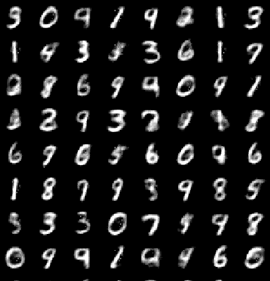

# Autoencoder Architectures and Metrics

This repository contains the architecture of convolutional and simple autoencoders, along with their corresponding performance metrics.

---

### 1. Convolutional Autoencoder
| **Metric**   | **Image** |
|--------------|-----------|
| **Training Loss (Per Batch):** |  |
| **Training Loss (Per Epoch):** |  |
| **Validation Loss (Per Batch):** |  |
| **Validation Loss (Per Epoch):** |  |
 
`Reconstructed Images:`
 
---

### 2. Simple Autoencoder
| **Metric**   | **Image** |
|--------------|-----------|
| **Training Loss:** |  |
| **Validation Loss:** |  |
 
`Reconstructed Images:` 
 
---
