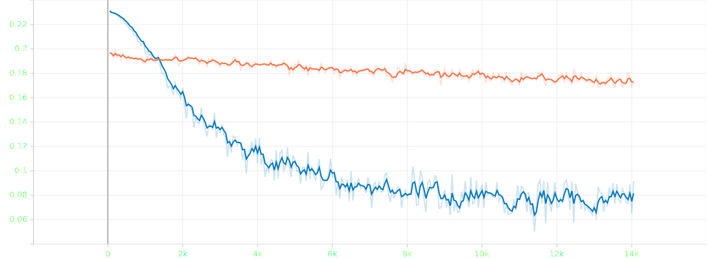
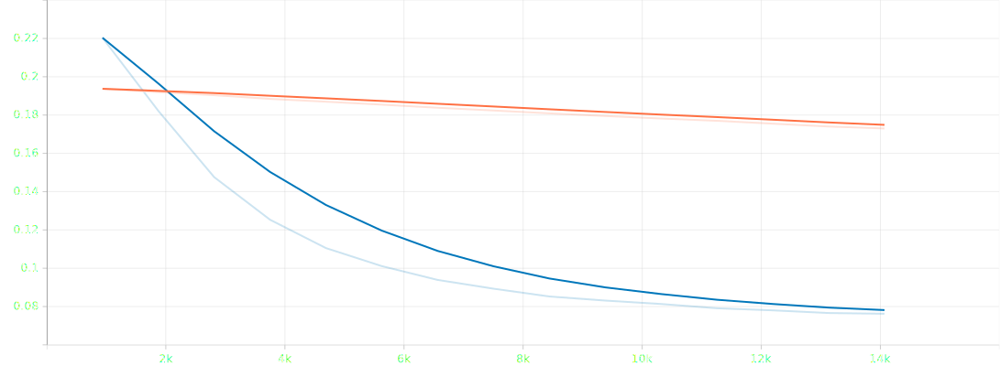
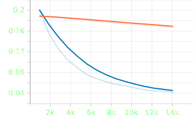
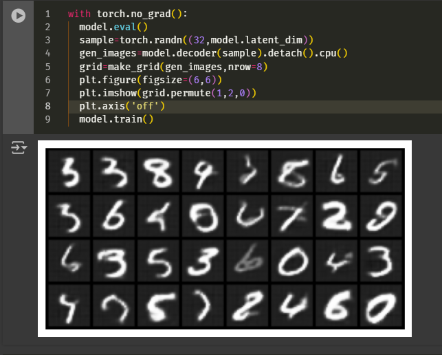
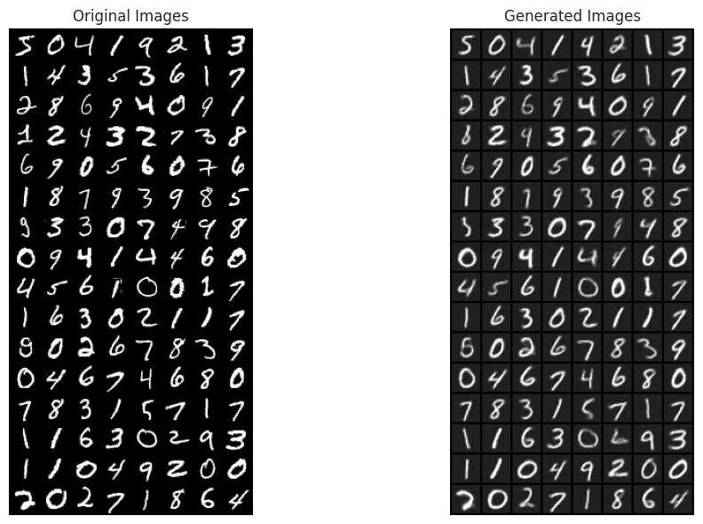

# Autoencoder Architectures and Metrics

This repository contains the architecture of various autoencoders.
---
### 1. Simple Autoencoder
| **Metric**   | **Image** |
|--------------|-----------|
| **Training Loss:** |  |
| **Validation Loss:** |  |
 

**Reconstructed Images:**

 
---

### 2. Convolutional Autoencoder
| **Metric**   | **Image** |
|--------------|-----------|
| **Training Loss (Per Batch):** |  |
| **Training Loss (Per Epoch):** |  |
| **Validation Loss (Per Batch):** |  |
| **Validation Loss (Per Epoch):** |  |

 

**Reconstructed Images**

---

### 3. Variational Autoencoder (VAE)
***Orange***: experiment-1, ***Blue***: experiment-2 |

| **Metric**   | **Image** |
|--------------|-----------|
| **Training Loss (Per Batch):** |  |
| **Training Loss (Per Epoch):** |  |
| **Validation Loss (Per Batch):** |  |
| **Validation Loss (Per Epoch):** |  |

 
| **Metric**   | **Image** |
| **KL Divergence Loss:** |  |
| **Reconstruction Loss:** |  |
| **Total Loss:** |  |

 

**Generated and Reconstructed Images**

| **Category** | **Image** |
|--------------|-----------|
| **Sampled from Latent Space:** |  |
| **Generated Images:** |  |
| **Reconstructed Images:** |  |

---

This layout provides a clean and organized structure for displaying the metrics and generated images related to your Variational Autoencoder (VAE). Make sure that all image paths match the actual location in your repository. Let me know if you need further adjustments!