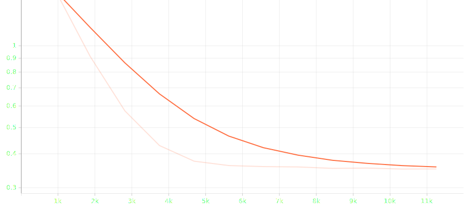
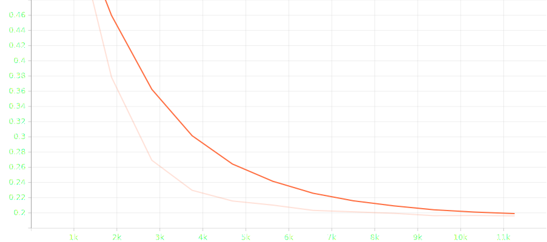
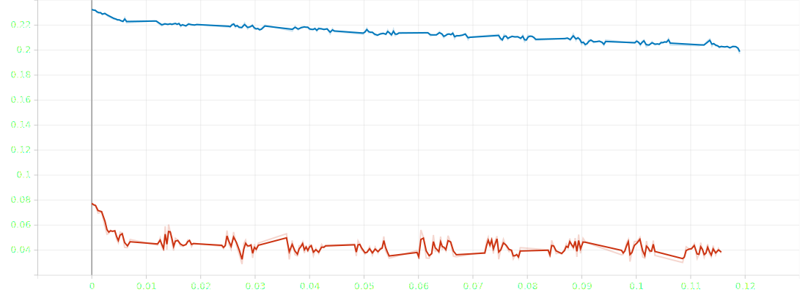
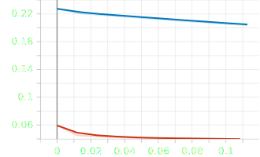
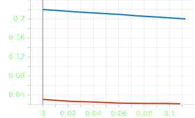
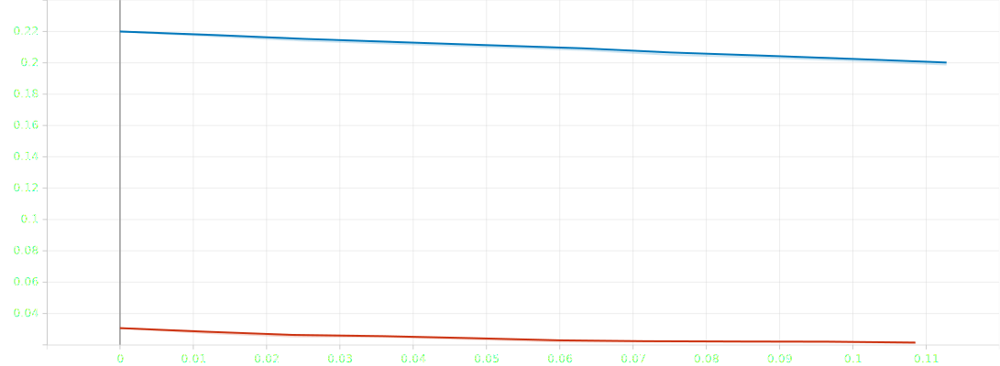
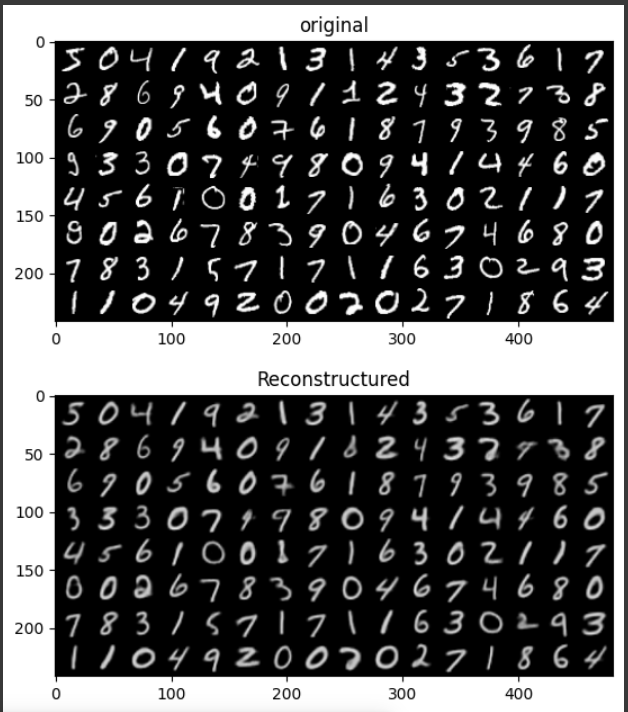

# Autoencoder Architectures and Metrics

This repository contains the architecture of various autoencoders.
---
### 1. Simple Autoencoder
| **Metric**   | **Image** |
|--------------|-----------|
| **Training Loss:** |  |
| **Validation Loss:** |  |
 

**Reconstructed Images:**

 
---

### 2. Convolutional Autoencoder
| **Metric**   | **Image** |
|--------------|-----------|
| **Training Loss (Per Batch):** |  |
| **Training Loss (Per Epoch):** |  |
| **Validation Loss (Per Batch):** |  |
| **Validation Loss (Per Epoch):** |  |

 

**Reconstructed Images**

---
