# Model Architectures and Metrics

This repository contains various deep learning models, their architecture diagrams, and performance metrics.

---

### 1. LeNet
| **Metric**   | **Image** |
|--------------|-----------|
| **Loss:**    | 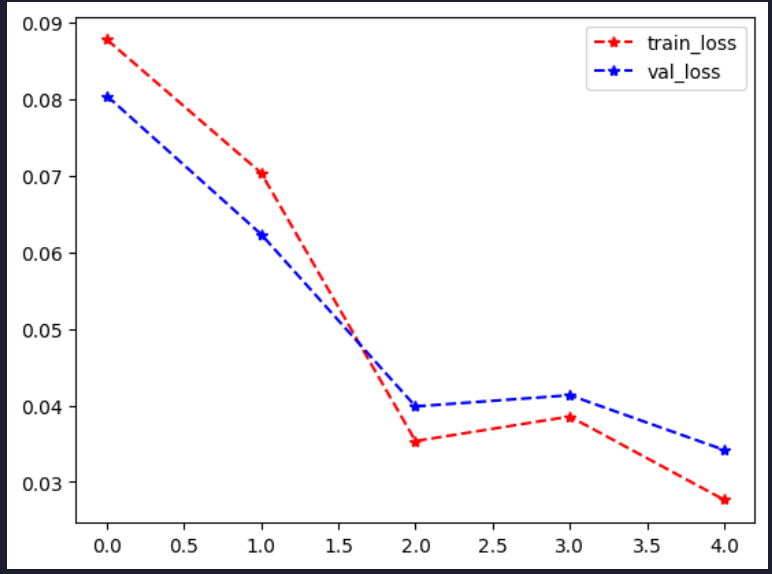 |
| **Accuracy:**| 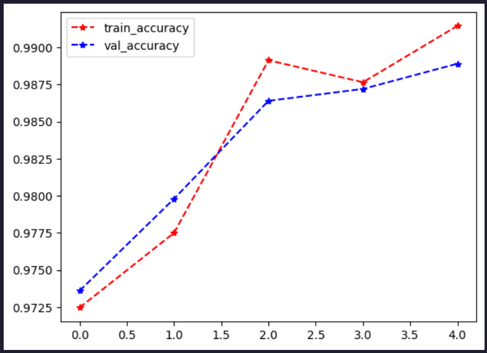 |

---

### 2. VGG Net
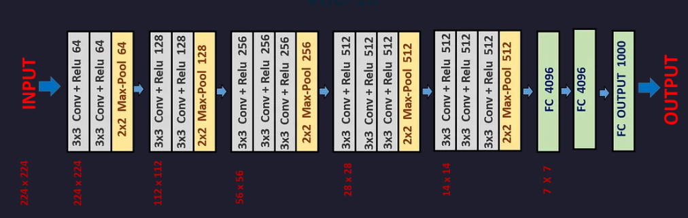

| **Metric**   | **Image** |
|--------------|-----------|
| **Loss:**    | 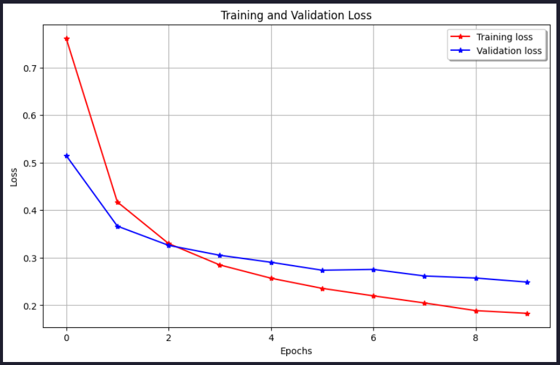 |
| **Accuracy:**| 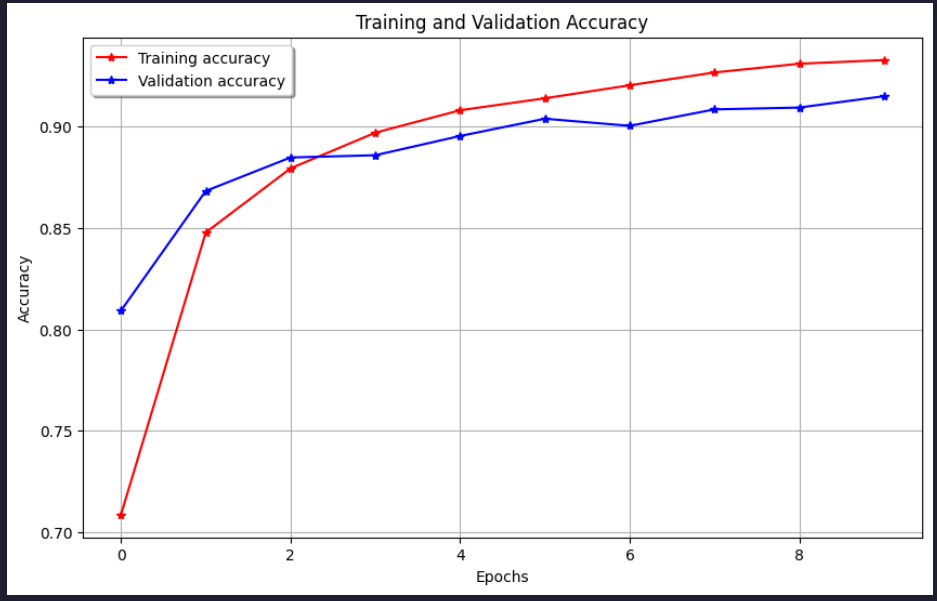 |

---

### 3. Google's Inception Net
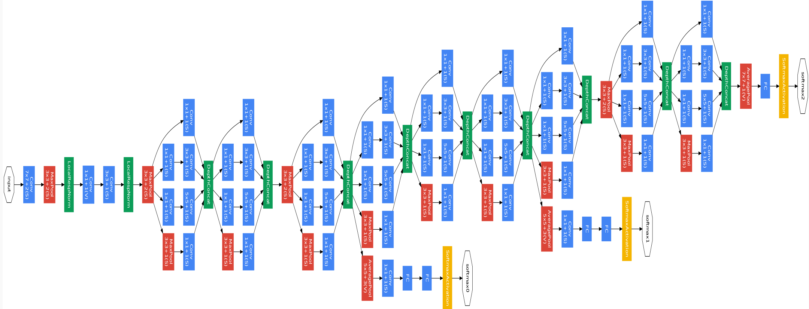
 
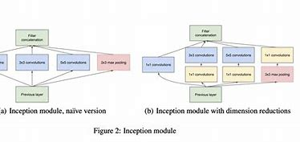

| **Metric**   | **Image** |
|--------------|-----------|
| **Loss:**    | 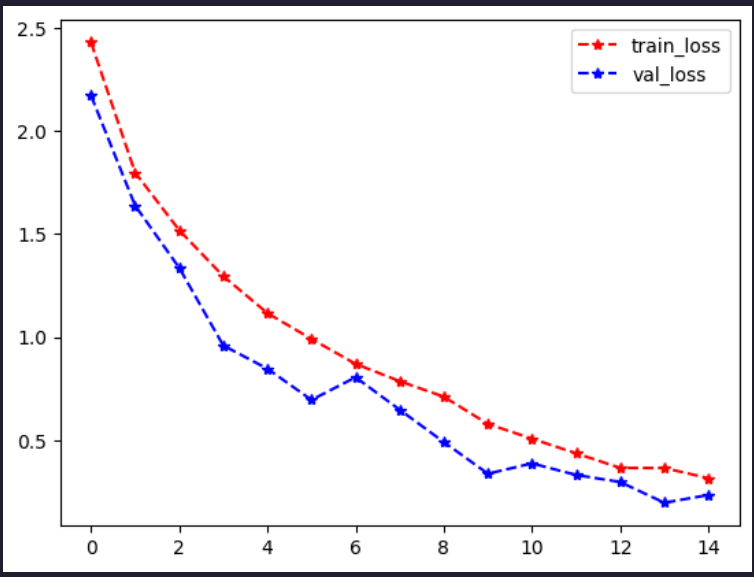 |
| **Accuracy:**| 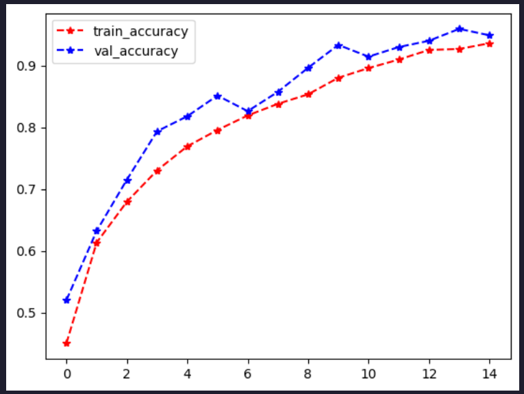 |

---

### 4. ResNet

| **Metric**   | **Image** |
|--------------|-----------|
| **Loss:**    | 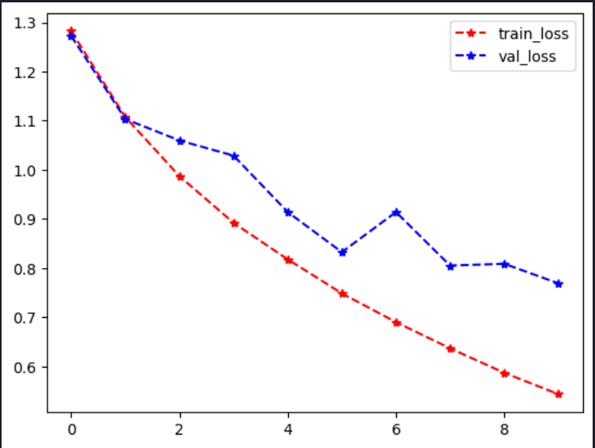 |
| **Accuracy:**| 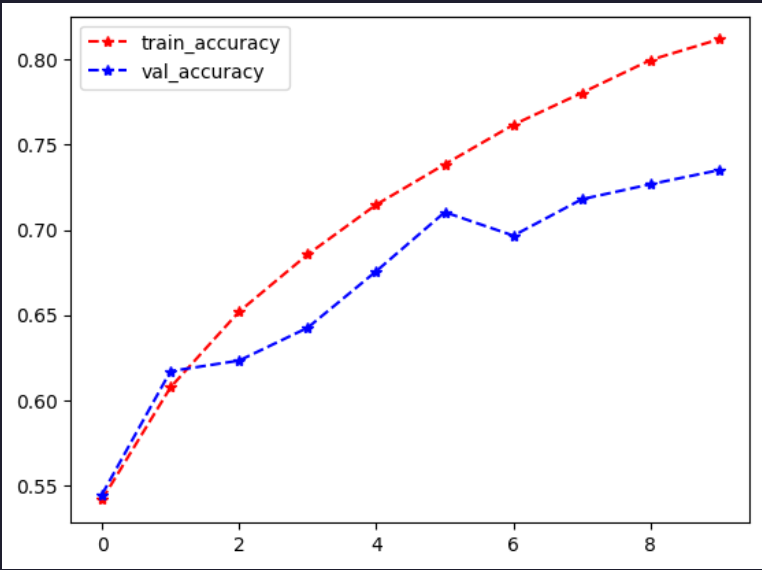 |

---

### 5. ResNeXt
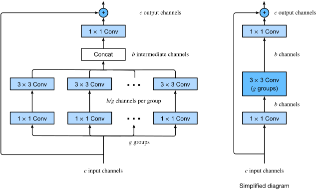

| **Metric**   | **Image** |
|--------------|-----------|
| **Loss:**    |  |
| **Accuracy:**|  |

---

### 6. DenseNet

| **Metric**   | **Image** |
|--------------|-----------|
| **Loss:**    | 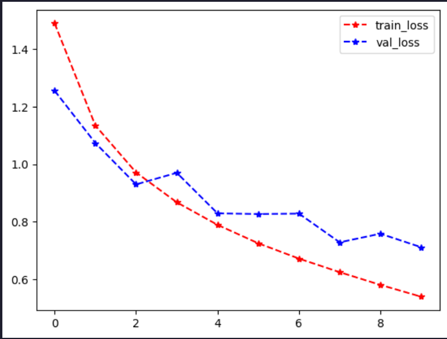 |
| **Accuracy:**| 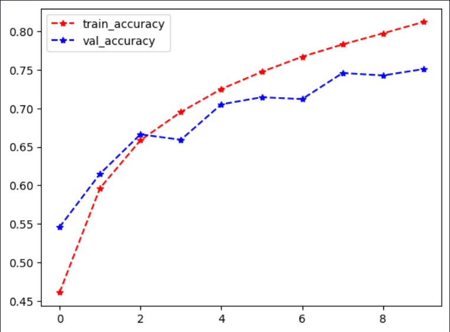 |

---
