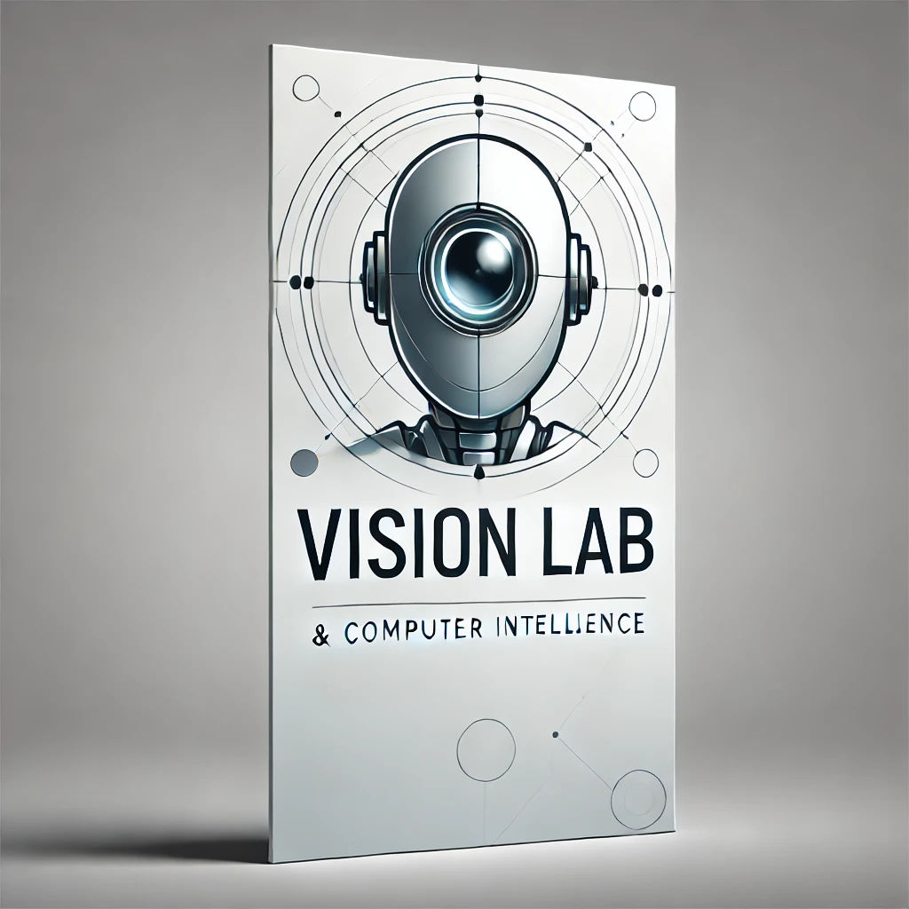

## Vision Lab Repository
Welcome to my Vision Lab repository! This collection features a range of computer vision models and architectures that I've developed from scratch. Here, you’ll discover various projects that highlight my journey in exploring different techniques in computer vision, including Autoencoders, Generative Adversarial Networks (GANs), and other innovative implementations.

### Overview

In this repository, I focus on building foundational models in computer vision, with each implementation designed to provide insights into the underlying mechanics and applications of these architectures. 

I plan to expand this repository with the following implementations:

- Computer Vision Architectures: As I learn, I will add implementations of popular architectures such as ResNets, RegNet, and others.
- Autoencoders: I will explain the inner workings of these systems and implement various types, including simple autoencoders, convolutional autoencoders, and variational autoencoders.
- Generative Adversarial Networks (GANs): Similar to autoencoders, I will delve into different GAN architectures and their applications.
Feel free to adjust any part further if you want to add your personal touch!
